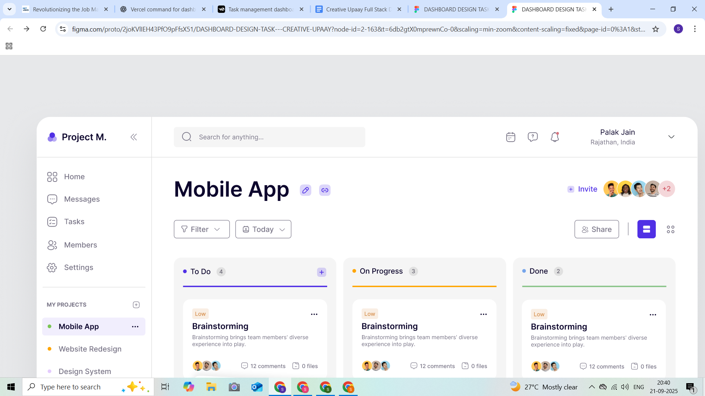

# Task Management Dashboard

A modern, responsive Kanban-style task management dashboard built with React, Next.js, and TypeScript. This project was created as part of the Creative Upaay Full Stack Development assignment.

## 🚀 Features

### Core Functionality
- **Kanban Board Layout**: Three-column layout (To Do, In Progress, Done) with task cards
- **Task Management**: Add, edit, and move tasks between different status columns
- **Drag & Drop**: Smooth drag-and-drop functionality for moving tasks between columns
- **Advanced Filtering**: Multi-criteria filtering by priority, category, and due date
- **Persistent Storage**: Tasks are saved to localStorage and persist across browser sessions
- **Responsive Design**: Fully responsive design that works on desktop, tablet, and mobile devices

### UI/UX Features
- **Pixel-Perfect Design**: Matches the provided Figma design exactly
- **Modern Aesthetics**: Clean, professional interface with proper spacing and typography
- **Interactive Elements**: Hover states, smooth animations, and visual feedback
- **Accessibility**: Proper ARIA labels, keyboard navigation, and screen reader support

### Technical Features
- **Redux State Management**: Centralized state management with Redux Toolkit
- **TypeScript**: Full type safety throughout the application
- **Modern React**: Uses React 19 with hooks and functional components
- **Tailwind CSS**: Utility-first CSS framework for rapid styling
- **Next.js 15**: Latest Next.js features including App Router

## 🛠️ Tech Stack

- **Frontend Framework**: Next.js 15.5.3
- **UI Library**: React 19.1.1
- **Language**: TypeScript 5.9.2
- **Styling**: Tailwind CSS 4.1.13
- **State Management**: Redux Toolkit 2.0.1
- **Drag & Drop**: @hello-pangea/dnd 18.0.1
- **Icons**: Lucide React 0.544.0
- **Analytics**: Vercel Analytics 1.5.0

## 📦 Installation & Setup

### Prerequisites
- Node.js 18+ 
- npm or yarn package manager

### Quick Start

1. **Clone the repository**
   \`\`\`bash
   git clone <repository-url>
   cd task-management-dashboard
   \`\`\`

2. **Install dependencies**
   \`\`\`bash
   npm install
   # or
   yarn install
   \`\`\`

3. **Start the development server**
   \`\`\`bash
   npm run dev
   # or
   yarn dev
   \`\`\`

4. **Open your browser**
   Navigate to [http://localhost:3000](http://localhost:3000) to see the application.

### Build for Production

\`\`\`bash
npm run build
npm start
\`\`\`

## 🎯 Usage

### Adding Tasks
1. Click the "+" button in any column header
2. Fill in the task details (title, description, priority)
3. Click "Add Task" to create the task

### Moving Tasks
- **Drag & Drop**: Click and drag any task card to move it between columns
- **Dropdown Menu**: Use the status dropdown in each task card for precise control

### Filtering Tasks
1. Use the filter bar at the top of the dashboard
2. Filter by:
   - **Priority**: High, Medium, Low
   - **Category**: Design, Development, Research, Testing
   - **Due Date**: Today, This Week, This Month, Overdue
3. Multiple filters can be applied simultaneously
4. Active filters are displayed as removable tags

### Clearing Filters
- Click individual "X" buttons on filter tags
- Use "Clear All" button to remove all filters at once

## 🏗️ Project Structure

\`\`\`
├── app/
│   ├── globals.css          # Global styles and Tailwind configuration
│   ├── layout.tsx           # Root layout component
│   └── page.tsx             # Main dashboard page
├── components/
│   ├── ui/                  # Reusable UI components
│   ├── filter-bar-figma.tsx # Advanced filtering component
│   ├── header.tsx           # Dashboard header with search and user info
│   ├── kanban-board-figma.tsx # Main Kanban board container
│   ├── kanban-column-figma.tsx # Individual column component
│   ├── sidebar.tsx          # Navigation sidebar
│   └── task-card-figma.tsx  # Individual task card component
├── lib/
│   ├── hooks.ts             # Redux hooks
│   └── store.ts             # Redux store configuration
└── public/
    └── images/              # Static assets
\`\`\`

## 🎨 Design System

### Typography
- **Font Family**: Inter (imported from Google Fonts)
- **Font Weights**: 400 (regular), 500 (medium), 600 (semibold), 700 (bold)
- **Font Sizes**: 12px, 14px, 16px, 20px, 24px (following Figma specifications)

### Color Palette
- **Primary**: Blue (#6366f1) for To Do column and primary actions
- **Secondary**: Orange (#f59e0b) for In Progress column
- **Success**: Green (#10b981) for Done column
- **Backgrounds**: Various shades of gray for cards and sections
- **Text**: Dark gray (#1a1a1a) for primary text, lighter grays for secondary text

### Spacing
- **Grid System**: 8px base unit (8px, 16px, 24px, 32px)
- **Border Radius**: 8px for cards and buttons (matching Figma)
- **Shadows**: Subtle shadows for depth and hierarchy

## 🔧 Configuration

### Environment Variables
No environment variables are required for basic functionality. The app uses localStorage for data persistence.

### Customization
- **Colors**: Modify CSS custom properties in `globals.css`
- **Typography**: Update font imports and classes in `globals.css`
- **Layout**: Adjust spacing and sizing in component files

## 📱 Responsive Design

The dashboard is fully responsive with breakpoints for:
- **Mobile**: < 768px (single column layout)
- **Tablet**: 768px - 1024px (two column layout)
- **Desktop**: > 1024px (three column layout)

## 🧪 Testing

### Manual Testing Checklist
- [ ] Tasks can be created with all required fields
- [ ] Drag and drop works between all columns
- [ ] Filters work correctly (priority, category, due date)
- [ ] Data persists after browser refresh
- [ ] Responsive design works on different screen sizes
- [ ] All interactive elements have proper hover states

## 🚀 Deployment

### Vercel (Recommended)
1. Push your code to GitHub
2. Connect your repository to Vercel
3. Deploy automatically with zero configuration

### Other Platforms
The app can be deployed to any platform that supports Next.js:
- Netlify
- AWS Amplify
- Railway
- DigitalOcean App Platform

## 🔮 Future Enhancements

### Planned Features
- [ ] User authentication and multi-user support
- [ ] Real-time collaboration
- [ ] Task assignments and notifications
- [ ] Advanced reporting and analytics
- [ ] Integration with external tools (Slack, Jira, etc.)
- [ ] Mobile app version

### Technical Improvements
- [ ] Unit and integration tests
- [ ] Performance optimization
- [ ] Offline support with service workers
- [ ] Database integration (PostgreSQL/MongoDB)
- [ ] API endpoints for data management

## 🤝 Contributing

1. Fork the repository
2. Create a feature branch (`git checkout -b feature/amazing-feature`)
3. Commit your changes (`git commit -m 'Add some amazing feature'`)
4. Push to the branch (`git push origin feature/amazing-feature`)
5. Open a Pull Request

## 📄 License

This project is licensed under the MIT License - see the [LICENSE](LICENSE) file for details.

## 👨‍💻 Author

Created as part of the Creative Upaay Full Stack Development assignment.

## 🙏 Acknowledgments

- Design inspiration from modern project management tools
- Figma design specifications provided by Creative Upaay
- React and Next.js communities for excellent documentation
- Tailwind CSS for the utility-first approach

---

**Note**: This project demonstrates proficiency in modern React development, state management, responsive design, and attention to design details. It showcases the ability to translate design specifications into functional, production-ready code.
